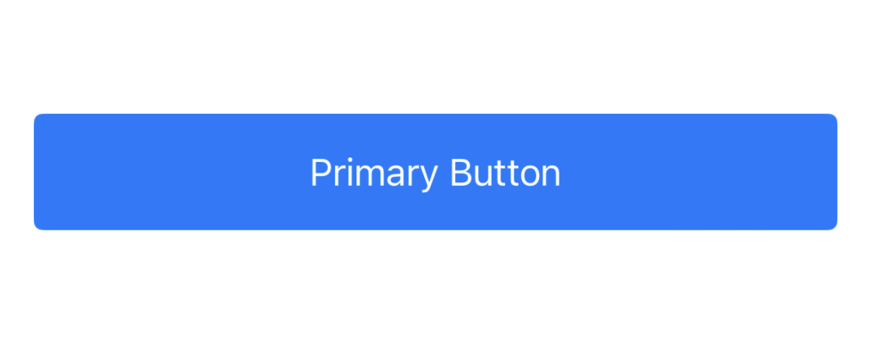
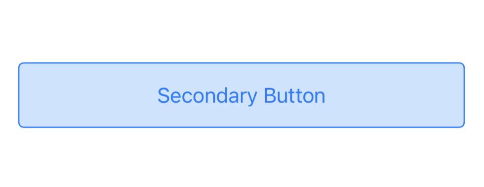
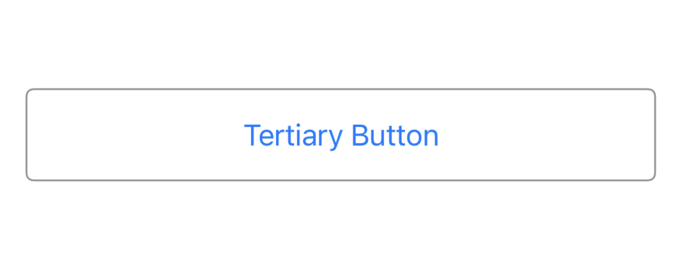
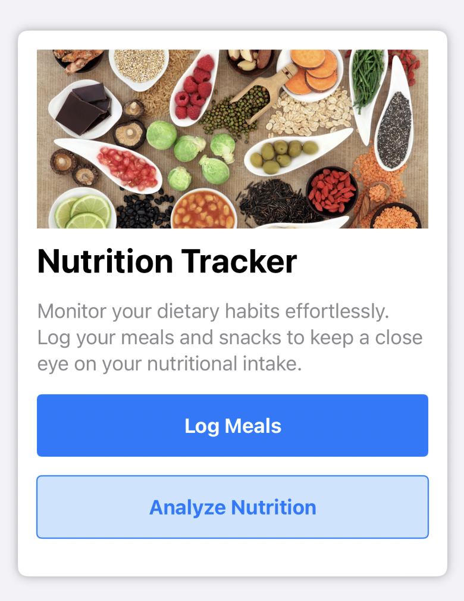
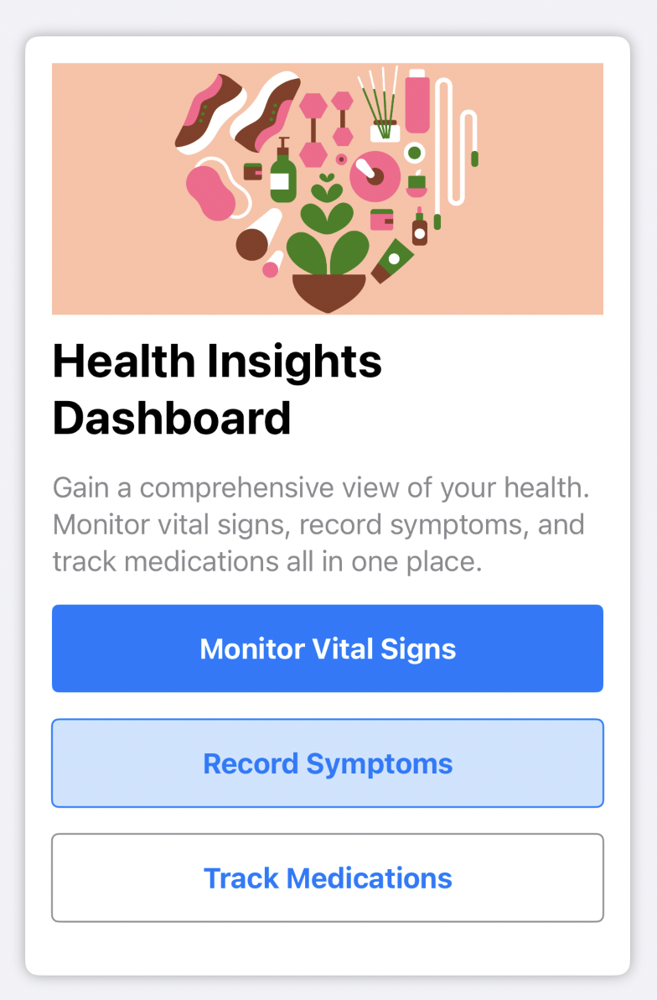
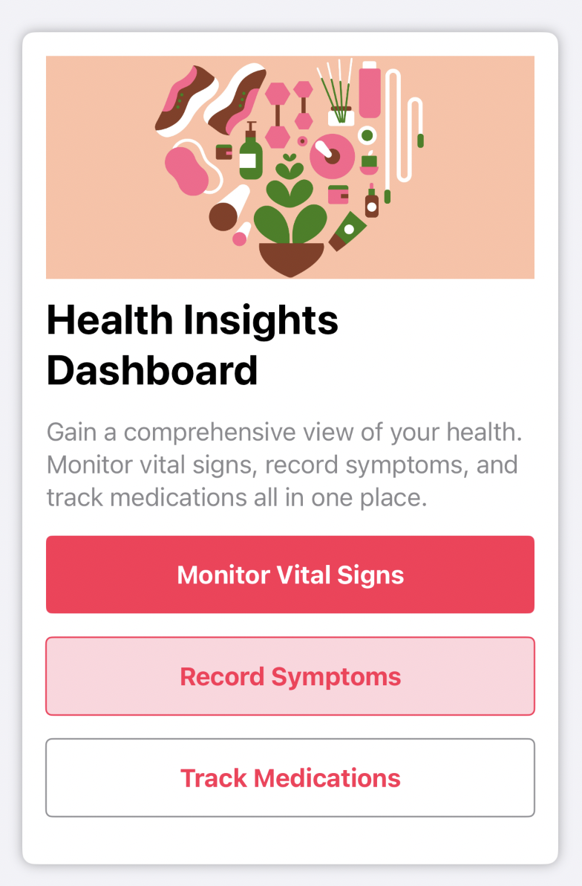
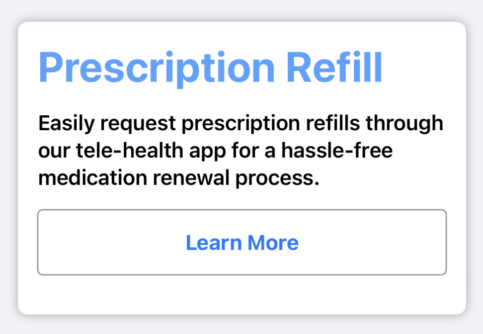
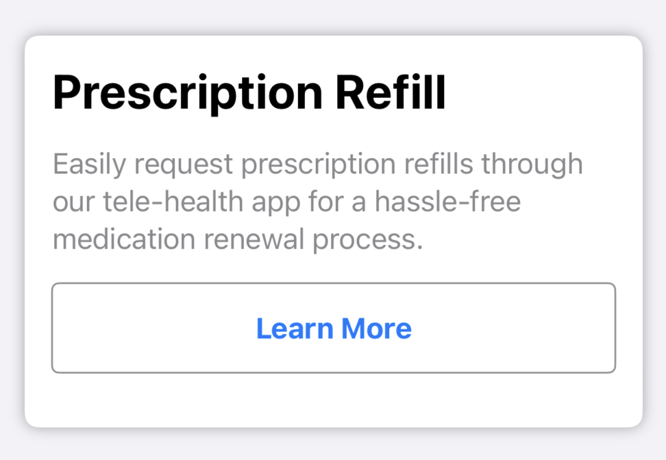

# OTFDesignSystem

OTFDesignSystem is TheraForge's design system framework that provides a set of UI components and utilities for creating cohesive and visually appealing user interfaces in TheraForge applications.

## Change Log
<summary>Release 1.0.1</summary>
<ul>
        <li>Added OTFSurveyCard component</li>
        <li>Added OTFMediaButtonStyle</li>
</ul>
</details>

<details>
<summary>Release 1.0.0</summary>
<ul>
        <li>Initial release of OTFDesignSystem</li>
        <li>Added OTFButtonStyles</li>
        <li>Added OTFInfoCardButton</li>
</ul>
</details>

## Table of contents
* [Overview](#overview)
* [Installation](#installation)
* [Components](#components)
  * [OTFButtonStyles](#otfbuttonstyles)
  * [OTFInfoCard](#otfinfocard)
  * [OTFSurveyCard](#otfsurveycard)
* [License](#license)

## Overview <a name="overview"></a>

OTFDesignSystem is a design system framework that facilitates the creation of visually consistent and user-friendly iOS applications. It offers a collection of SwiftUI UI components and utilities, allowing developers to build interfaces with ease and maintain a unified design across the application.

## Installation <a name="installation"></a>

### CocoaPods

Add the following line to your Podfile:

```ruby
pod 'OTFDesignSystem'
```

Run `pod install` in your terminal.

## Components <a name="components"></a>

### OTFButtonStyles <a name="otfbuttonstyles"></a>

This framework provides three custom button styles—Primary, Secondary, and Tertiary—that can be applied to SwiftUI's `Button`


#### OTFPrimaryButtonStyle


```swift
import SwiftUI
import OTFDesignSystem

struct MyView: View {
    var body: some View {
        Button("Primary Button") {
            // Handle button tap
        }
        .buttonStyle(.otfPrimary)
    }
}
```

#### OTFSecondaryButtonStyle


```swift
import SwiftUI
import OTFDesignSystem

struct MyView: View {
    var body: some View {
        Button("Secondary Button") {
            // Handle button tap
        }
        .buttonStyle(.otfSecondary)
    }
}
```

#### OTFTertiaryButtonStyle


```swift
import SwiftUI
import OTFDesignSystem

struct MyView: View {
    var body: some View {
        Button("Tertiary Button") {
            // Handle button tap
        }
        .buttonStyle(.otfTertiary)
    }
}
```

There's also an additional style for media playback buttons

#### OTFMediaButtonStyle


```swift
import SwiftUI
import OTFDesignSystem

struct MyView: View {
    var body: some View {
        Button {
            // Handle button tap
        } label: {
            Image(systemName: "backward.fill")
        }
        .buttonStyle(.otfPrimary)
    }
}
```

### OTFInfoCard <a name="otfinfocard"></a>


The `OTFInfoCard` is a versatile component for presenting information with optional actions. It provides flexibility in defining the title, description, and actions, making it suitable for various scenarios.

#### Usage



```swift
import OTFDesignSystem
import SwiftUI

struct MyInfoCardView: View {
    var body: some View {
        OTFInfoCard(
            title: "nutrition",
            description: "Monitor your dietary habits effortlessly. Log your meals and snacks to keep a close eye on your nutritional intake.",
            actions: [
                .init(label: "Log Meals", style: .primary) {
                    // Handle action on Log Meals button
                },
                .init(label: "Analyze Nutrition", style: .secondary) {
                    // Handle action on Analyze Nutrition button
                },
            ]
        )
    }
}
```

#### Action Set Up

The OTFInfoCard can display a set of buttons to trigger an action. You can add as many buttons as you want, and they can also use the OTFButtonStyles that have been described above. Each action is represented by an instance of a `OTFInfoCardAction`, which takes a label, which will be displayed inside the button, the style, which can be either of the styles described above, and an action, which will be executed when the button is pressed.

```swift
OTFInfoCard(
    image: Image("health-dashboard"),
    title: "Health Insights Dashboard",
    description: "Gain a comprehensive view of your health. Monitor vital signs, record symptoms, and track medications all in one place.",
    actions: [
        OTFInfoCardAction(label: "Monitor Vital Signs", style: .primary) {
            // Handle Get Started action
        },
        OTFInfoCardAction(label: "Record Symptoms", style: .secondary) {
            // Handle Learn More action
        },
        OTFInfoCardAction(label: "Track Medications", style: .tertiary) {
            // Handle Learn More action
        },
    ]
)
```



To customize the colors of the buttons, just use the `.foregroundColor(_:)` modifier on the `OTFInfoCard` component:

```swift
OTFInfoCard(
    image: Image("health-dashboard"),
    title: "Health Insights Dashboard",
    description: "Gain a comprehensive view of your health. Monitor vital signs, record symptoms, and track medications all in one place.",
    actions: [
        OTFInfoCardAction(label: "Monitor Vital Signs", style: .primary) {
            // Handle Get Started action
        },
        OTFInfoCardAction(label: "Record Symptoms", style: .secondary) {
            // Handle Learn More action
        },
        OTFInfoCardAction(label: "Track Medications", style: .tertiary) {
            // Handle Learn More action
        },
    ]
).foregroundColor(.pink)
```



#### Customizable Labels

You have full control over the styling of the title and description in the OTFInfoCard. You can customize their labels by passing an instance of Text for each field, allowing you to apply specific styling, just as you would with a regular SwiftUI Text view:



```swift
OTFInfoCard(
    title: Text("Prescription Refill")
        .font(.largeTitle)
        .fontWeight(.bold)
        .foregroundColor(.blue.opacity(0.7)),
    description: Text("Easily request prescription refills through our tele-health app for a hassle-free medication renewal process.")
        .fontWeight(.semibold)
        .foregroundColor(.black),
    actions: [
        .init(label: "Learn More", style: .tertiary),
    ]
)
```

For more general use, you can simplify it by passing a String, and the component will handle the styling for each field:



```swift
OTFInfoCard(
    title: "Prescription Refill",
    description: "Easily request prescription refills through our tele-health app for a hassle-free medication renewal process.",
    actions: [
        .init(label: "Learn More", style: .tertiary),
    ]
)
```

### OTFSurveyCard <a name="otfsurveycard"></a>

The `OTFSurveyCard `component is a SwiftUI view designed for displaying survey cards within an app. It offers a customizable card layout with a title, a call-to-action button, and an indication of whether the survey has been completed.

#### Usage


```swift
struct ContentView: View {
    var body: some View {
        OTFSurveyCard(
            title: "Are you feeling better after today's medications?",
            callToAction: "Report",
            hasBeenAnswered: false
        )
    }
}
```

# License <a name="License"></a>

This project is made available under the terms of a modified BSD license. See the [LICENSE](LICENSE.md) file.
