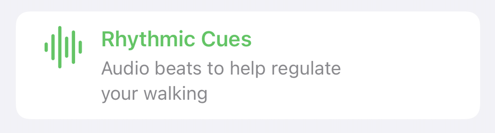

# OTFDesignSystem

OTFDesignSystem is TheraForge's design system framework that provides a set of UI components and utilities for creating cohesive and visually appealing user interfaces in TheraForge applications.

## Change Log
<details>
<summary>Release 1.0.2</summary>
<ul>
    <li>Added OTFEmptyState component</li>
    <li>Added OTFMedicationCard component</li>
    <li>Added OTFStimuliCard component</li>
    <li>Added OTFPillButtonStyle</li>
    <li>Updated OTFSurveyCard layout</li>
</ul>
</details>

<details>
<summary>Release 1.0.1</summary>
<ul>
    <li>Added OTFSurveyCard component</li>
    <li>Added OTFMediaButtonStyle</li>
</ul>
</details>

<details>
<summary>Release 1.0.0</summary>
<ul>
    <li>Initial release of OTFDesignSystem</li>
    <li>Added OTFButtonStyles</li>
    <li>Added OTFInfoCardButton</li>
</ul>
</details>

## Table of contents
* [Overview](#overview)
* [Installation](#installation)
* [Components](#components)
  * [OTFButtonStyles](#otfbuttonstyles)
  * [OTFInfoCard](#otfinfocard)
  * [OTFSurveyCard](#otfsurveycard)
  * [OTFEmptyState](#otfemptystate)
  * [OTFMedicationCard](#otfmedicationcard)
  * [OTFStimuliCard](#otfstimulicard)
* [License](#license)

## Overview <a name="overview"></a>

OTFDesignSystem is a design system framework that facilitates the creation of visually consistent and user-friendly iOS applications. It offers a collection of SwiftUI UI components and utilities, allowing developers to build interfaces with ease and maintain a unified design across the application.

## Installation <a name="installation"></a>

### CocoaPods

Add the following line to your Podfile:

```ruby
pod 'OTFDesignSystem'
```

Run `pod install` in your terminal.

## Components <a name="components"></a>

### OTFButtonStyles <a name="otfbuttonstyles"></a>

This framework provides four custom button styles—Primary, Secondary, Tertiary, and Pill—that can be applied to SwiftUI's `Button`.


#### OTFPrimaryButtonStyle


```swift
import SwiftUI
import OTFDesignSystem

struct MyView: View {
    var body: some View {
        Button("Primary Button") {
            // Handle button tap
        }
        .buttonStyle(.otfPrimary)
    }
}
```


#### OTFSecondaryButtonStyle


```swift
import SwiftUI
import OTFDesignSystem

struct MyView: View {
    var body: some View {
        Button("Secondary Button") {
            // Handle button tap
        }
        .buttonStyle(.otfSecondary)
    }
}
```


#### OTFTertiaryButtonStyle


```swift
import SwiftUI
import OTFDesignSystem

struct MyView: View {
    var body: some View {
        Button("Tertiary Button") {
            // Handle button tap
        }
        .buttonStyle(.otfTertiary)
    }
}
```


#### OTFPillButtonStyle


```swift
import SwiftUI
import OTFDesignSystem

struct MyView: View {
    var body: some View {
        Button("Pill Button") {
            // Handle button tap
        }
        .buttonStyle(.otfPill)
    }
}
```


#### OTFMediaButtonStyle


```swift
import SwiftUI
import OTFDesignSystem

struct MyView: View {
    var body: some View {
        Button {
            // Handle button tap
        } label: {
            Image(systemName: "backward.fill")
        }
        .buttonStyle(.otfMedia)
    }
}
```

### OTFInfoCard <a name="otfinfocard"></a>


The `OTFInfoCard` is a versatile component for presenting information with optional actions. It provides flexibility in defining the title, description, and actions, making it suitable for various scenarios.

#### Usage


```swift
import OTFDesignSystem
import SwiftUI

struct MyInfoCardView: View {
    var body: some View {
        OTFInfoCard(
            title: "nutrition",
            description: "Monitor your dietary habits effortlessly. Log your meals and snacks to keep a close eye on your nutritional intake.",
            actions: [
                .init(label: "Log Meals", style: .primary) {
                    // Handle action on Log Meals button
                },
                .init(label: "Analyze Nutrition", style: .secondary) {
                    // Handle action on Analyze Nutrition button
                },
            ]
        )
    }
}
```

### OTFSurveyCard <a name="otfsurveycard"></a>

The `OTFSurveyCard` is a component designed for displaying survey or questionnaire items in a visually appealing manner.

#### Usage


```swift
import SwiftUI
import OTFDesignSystem

struct ContentView: View {
    var body: some View {
        OTFSurveyCard(
            title: "Mood Check",
            description: "How are you feeling today?",
            systemImage: "face.smiling.inverse",
            callToAction: "Get Started",
            hasBeenAnswered: false
        ) {
            // Action to perform when tapped
        }
    }
}
```

### OTFEmptyState <a name="otfemptystate"></a>

The `OTFEmptyState` component is used to display a message when there is no content to show.

#### Usage


```swift
import SwiftUI
import OTFDesignSystem

struct ContentView: View {
    var body: some View {
        OTFEmptyState(
            "No Items Found",
            systemName: "magnifyingglass",
            message: "It looks like there’s nothing here yet. Start adding some items to get going!",
            action: .init(label: "Add New Item", action: {
                // Handle add stimulus action
            })
        )
    }
}
```

### OTFMedicationCard <a name="otfmedicationcard"></a>

The `OTFMedicationCard` is designed to present medication details including name, dosage, and schedule.

#### Usage


```swift
import SwiftUI
import OTFDesignSystem

struct ContentView: View {
    var body: some View {
        OTFMedicationCard(
            title: "Levodopa",
            dosage: "100mg",
            schedule: "08:00 AM",
            isCompleted: false
        ) { newStatus in
            // Handle status change
        }
    }
}
```

### OTFStimuliCard <a name="otfstimulicard"></a>

The `OTFStimuliCard` is designed to present various stimuli options in a visually appealing manner.

#### Usage



```swift
import SwiftUI
import OTFDesignSystem

struct ContentView: View {
    var body: some View {
        OTFStimuliCard(
            title: "Rhythmic Cues",
            description: "Audio beats to help regulate your walking",
            systemImage: "waveform",
            tintColor: .blue
        )
    }
}
```

# License <a name="License"></a>

This project is made available under the terms of a modified BSD license. See the [LICENSE](LICENSE.md) file.
